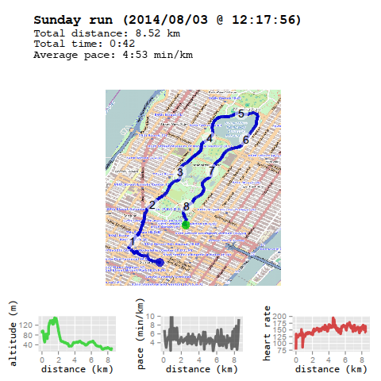

# Description

This short R code snippet is written to process GPS coordinate and heart beat
rate files, such as recorded by *Garmin Forerunner 405* sports watch. The idea
is to take the data and present it in a nice card-like format, which allows
obtaining all interesting information about the run with a simple glance.

The output is an image file with the following information:

- WEEKDAY (DATE @ TIME)
- Total distance: DIST
- Total time: TIME
- Average pace: PACE

and an [OpenStreetMap][OSM] map with overlayed GPS coordinates (dots) plus
three plots: altitude vs. distance, pace vs. distance and heart rate vs.
distance.  On the map, GPS coordinates matching most closely to full kilometers
are highlighted with numbers.

Here is an example image from data provided in file `example.csv`:

Note that the distance information is accurately calculated with the ellipsoidal
formula by Thaddeus Vincenty (Earth is not a ball, after all) and includes a
correction which takes altitude differences into account (I run close to the
Alps, altitude differences can be several hundreds of meters during one run).

For pace, the individual data points are **way** too noisy. So, the pace is
calculated separately for every 100 m trek, which seems to give reasonably
trustworthy values.

## Required R packages

- OpenStreetMap
- ggplot2
- wq
- extrafont
- optparse

## TODO

- Cleaning up the code (it's a mess right now)
- Checks for the input parameters, files, etc.

## Usage

`runmap.R -i gpsdata.csv -t svg -o outfile.svg`

## On obtaining the GPS data

At the moment, the code assumes that the data is given in csv format. To get it
from the Garmin, I use
[python-ant-downloader][https://github.com/braiden/python-ant-downloader] by
Braiden Kindt, which gives me tcx data, which I then convert with
[gpsbabel][http://www.gpsbabel.org/] with the following command

`gpsbabel -t -i gtrnctr -f gpsdata.tcx -o unicsv -F gpsdata.csv`

where `gpsdata.tcx` is the file from `python-ant-downloader` and `gpsdata.csv` is the
new file to be fed to `runmap`.

## Resources

The code for calculating the geodesic distance between two points is originally
by Mario Pineda-Krch from [r-bloggers.com][R1], which in turn is an adaptation
from the JavaScript code by Chriss Veness from [movable-type.co.uk][R2]
(attribution license).

## Author

This code has been written by Jani Kotakoski <jkkoski@iki.fi> and is provided
in the hope that it will be useful also for others.

## Licence and copyright

Copyright 2014 Jani Kotakoski, released under the MIT License (see License.txt).

[OSM]: http://www.openstreetmap.org/
[R1]:  http://www.r-bloggers.com/great-circle-distance-calculations-in-r/
[R2]:  http://www.movable-type.co.uk/scripts/latlong-vincenty.html

